# Agentic Scheduler — Deterministic Architecture Diagrams

> Status: **Architecture Baseline**  
> Companion document: [`DOMAIN_INVARIANTS.md`](./DOMAIN_INVARIANTS.md)

This document defines the intended runtime boundaries and allowed data flows for Agentic Scheduler.

The diagrams are deliberately strict. They are not merely illustrative UI sketches: arrows represent allowed architectural dependencies or runtime flows. A missing shortcut is usually intentional.

---

# 1. System-wide architecture

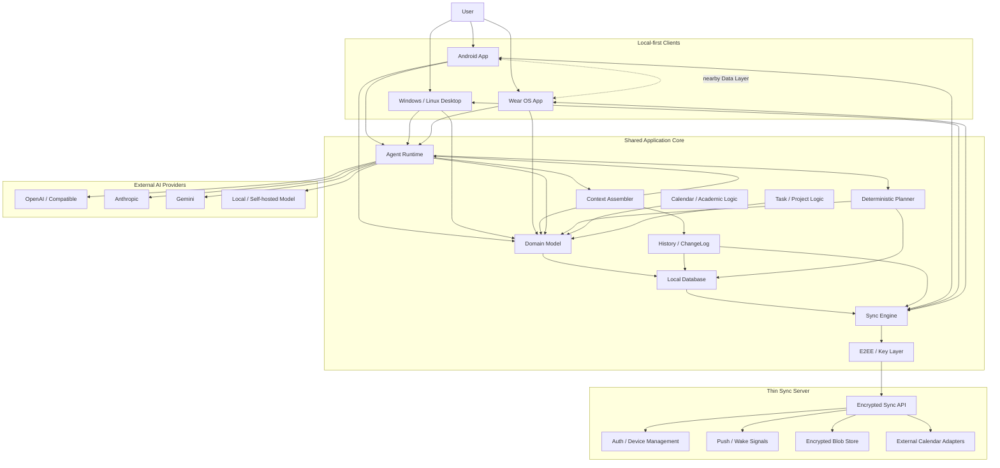

## Meaning

The client is the primary execution environment.

- Domain semantics live on clients.
- Planner execution lives on clients.
- Agent execution lives primarily on clients.
- E2EE occurs before synchronized user content leaves the trusted client boundary.
- The server transports/stores encrypted application data and coordinates devices.
- AI Providers never become the source of truth for either schedule state or Agent memory.

---

# 2. Dependency direction

Compile-time/module dependencies should remain approximately directional:

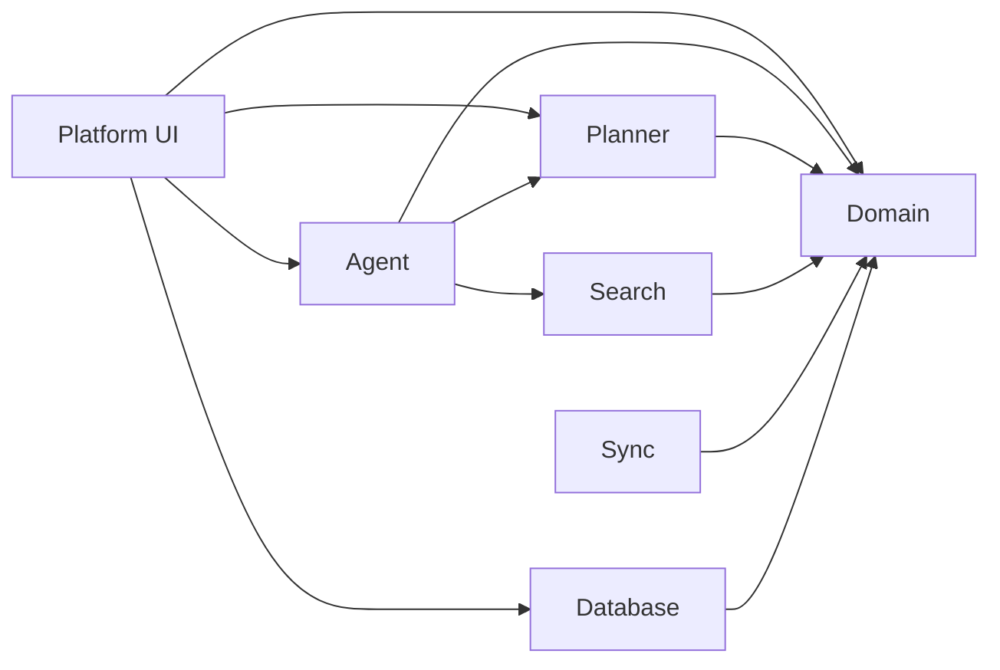

## Forbidden dependency inversions

```text
Domain -> Room / SQLDelight             FORBIDDEN
Domain -> Ktor                          FORBIDDEN
Domain -> Compose                       FORBIDDEN
Domain -> Android Context               FORBIDDEN
Domain -> OpenAI / Anthropic SDK        FORBIDDEN
Planner -> UI                           FORBIDDEN
Sync -> Platform UI                     FORBIDDEN
Provider adapter -> business rules      FORBIDDEN
```

Platform-specific adapters may implement interfaces owned by higher-level application modules, but Domain semantics must not depend on those implementations.

---

# 3. Universal Command / Agent runtime path

This is the normal path for every conversational Agent command.

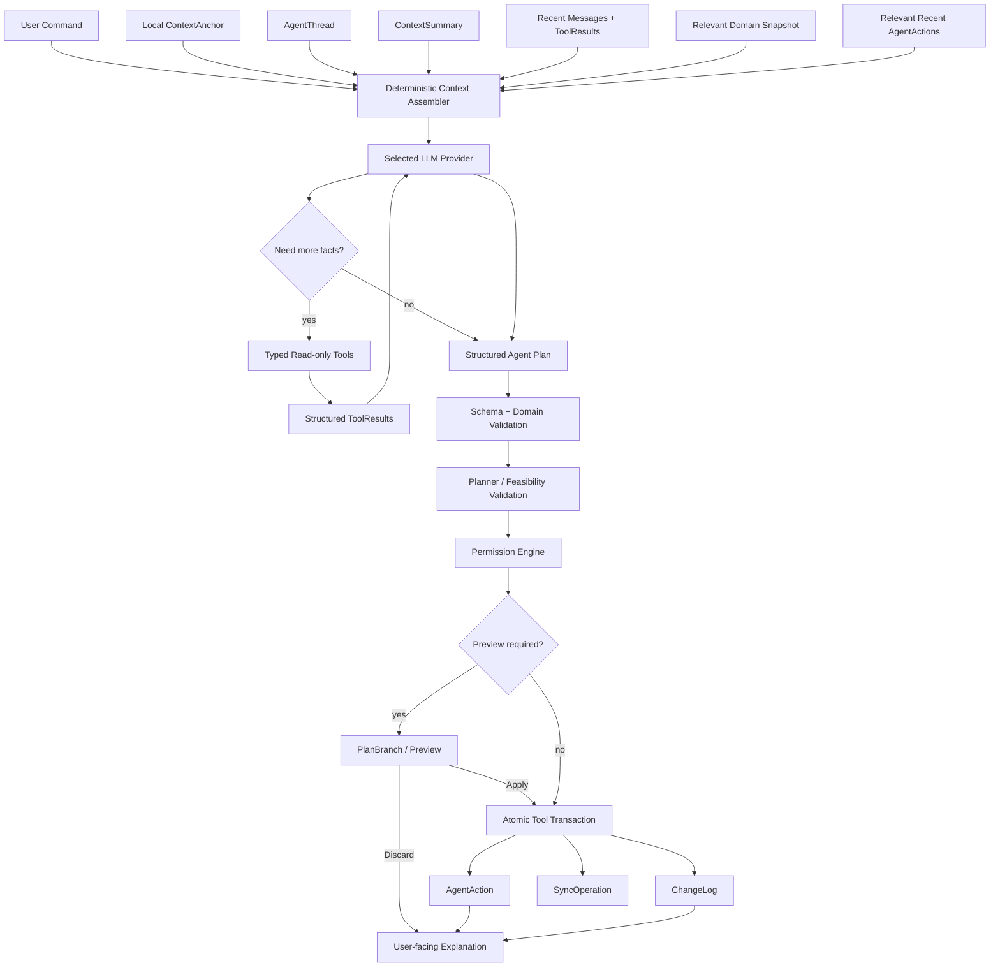

## Hard invariant

There is **no legal edge**:

```text
LLM -> Database
LLM -> Repository.write
LLM -> Server mutation
```

The only write path is:

```text
LLM proposal
→ typed Tool
→ validation
→ Planner/Domain rules
→ permission
→ optional PlanBranch
→ atomic transaction
→ audit/history
→ sync operation
```

---

# 4. Context and long-term Agent memory

The LLM context window is temporary. Scheduler-owned memory is persistent.

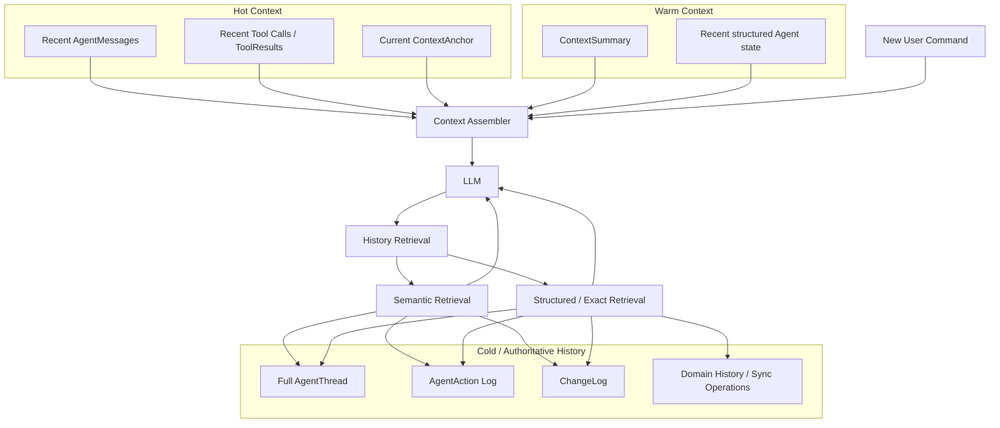

## Consequence

A conversation can exceed any individual model context window without becoming stateless.

Older material is compacted into `ContextSummary`, while authoritative historical records remain retrievable.

Changing Provider:

```text
OpenAI -> Claude -> Gemini -> Local Model
```

must not reset the Scheduler's Agent memory.

---

# 5. Factual authority hierarchy

When sources disagree, the following precedence is used for factual claims about the application:

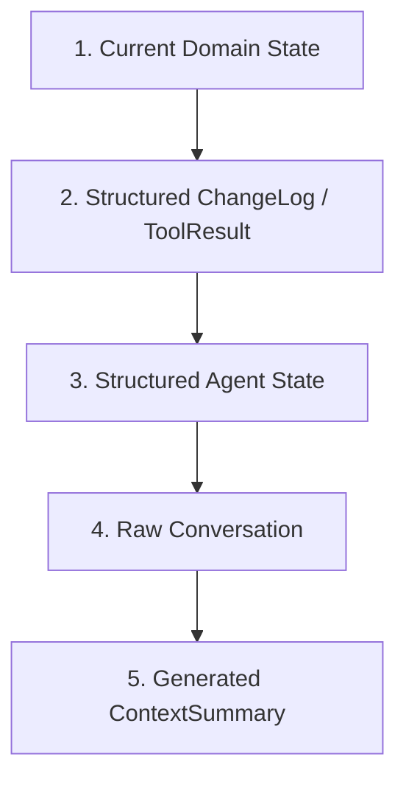

This is a **truth-authority ordering**, not necessarily the order in which prompt text is serialized.

Examples:

- If the Agent said "I moved the meeting" but ToolResult says the transaction failed, the meeting was **not moved**.
- If ContextSummary says an Event was cancelled but current Domain State says it exists and ChangeLog shows only a reschedule, the summary is wrong.

---

# 6. History / ChangeLog architecture

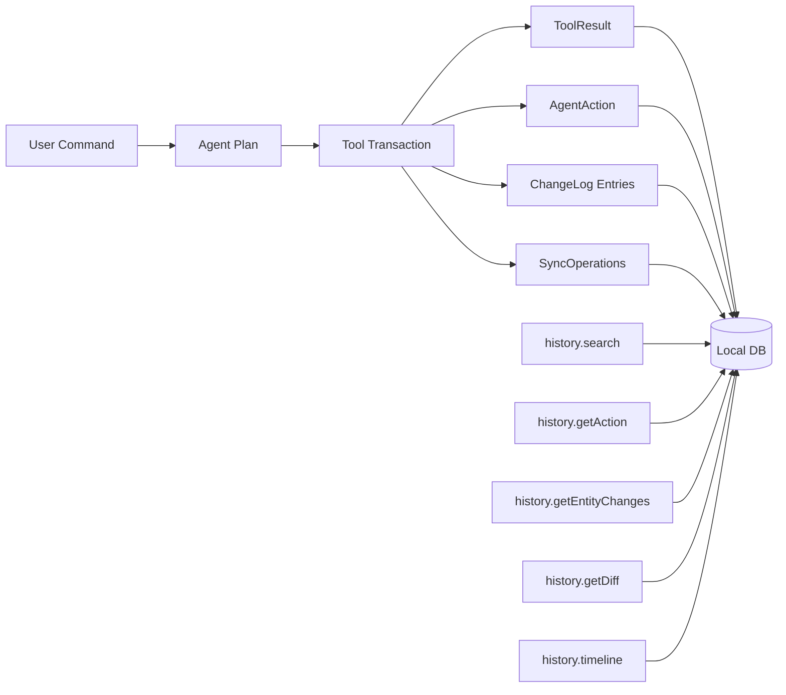

History APIs are read-only from the Agent's perspective.

Undo is modeled as a new action:

```text
#201 move Event A
#202 undo #201
```

not as deletion of `#201`.

---

# 7. Deterministic Planner architecture

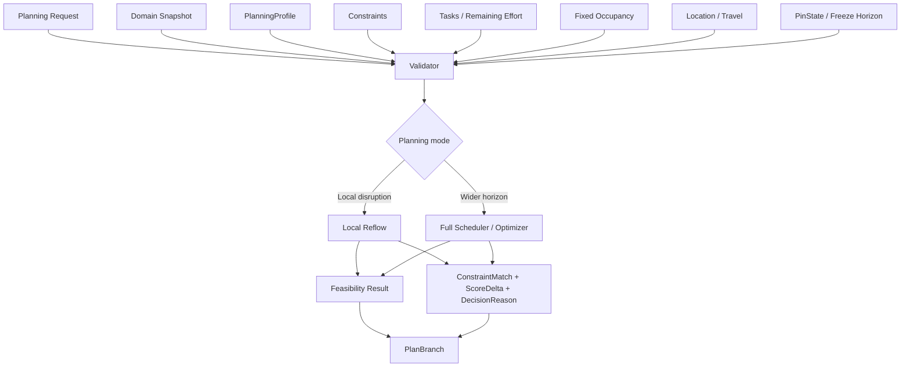

The LLM may produce the human-readable explanation, but only from the structured explanation facts emitted by the Planner.

---

# 8. PlanBranch lifecycle

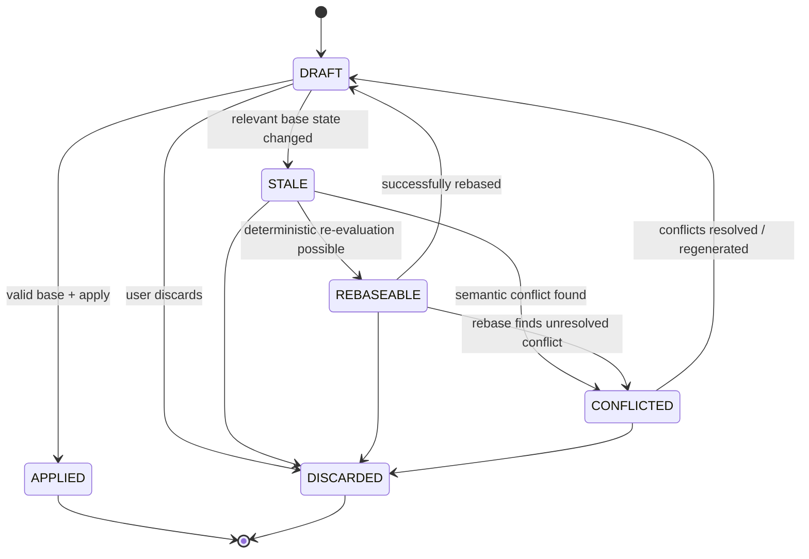

Apply is atomic. A PlanBranch never becomes partially active.

PlanBranch-only data has no ordinary active-calendar side effects before Apply.

---

# 9. Local-first mutation and synchronization path

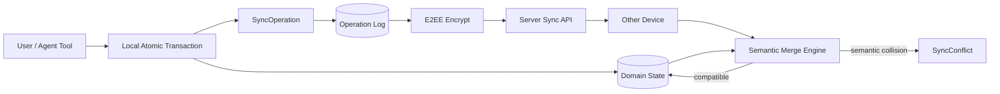

The server is a transport/storage participant; it does not decide plaintext domain merge semantics.

---

# 10. Sync causality model

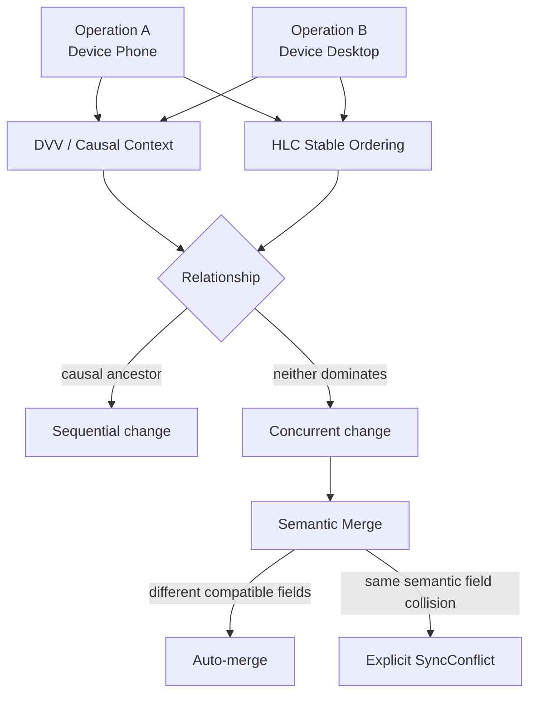

HLC does **not** authorize Last-Write-Wins for semantic conflicts. It provides stable ordering metadata where ordering is needed.

---

# 11. E2EE data boundary

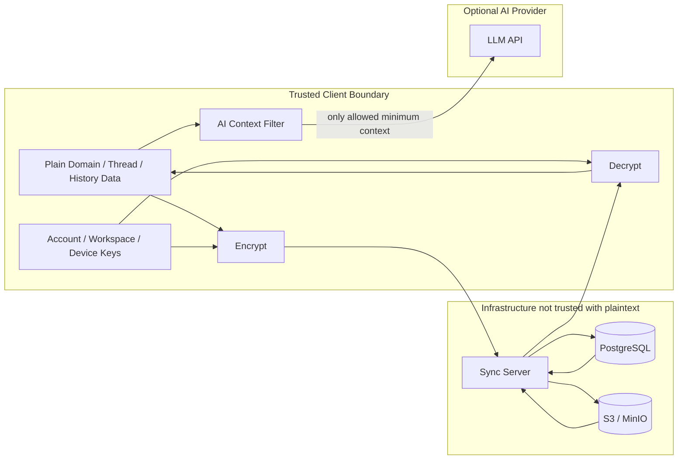

The AI Provider privacy boundary is separate from the Sync Server privacy boundary. Sending allowed context to an explicitly configured AI Provider does not imply the Sync Server receives plaintext.

---

# 12. Wear OS runtime architecture

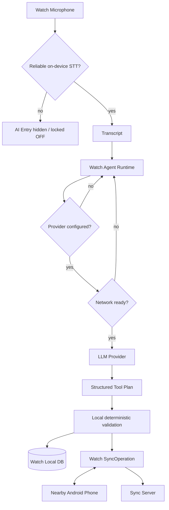

Important state separation:

```text
aiEntrySupported   = device/STT capability
aiEntryEnabled     = user preference
providerConfigured = usable provider profile/credential available
networkReady       = current request can reach provider
```

Network loss does not remove AI capability. It only makes cloud requests temporarily unavailable.

Core watch calendar/task functions remain usable without AI.

---

# 13. Wear Provider provisioning

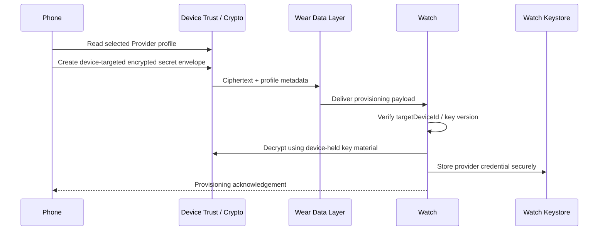

Ordinary Data Layer transport is not treated as the sole confidentiality boundary. Secret material remains application-encrypted for the target device.

---

# 14. Phone ↔ Watch offline synchronization

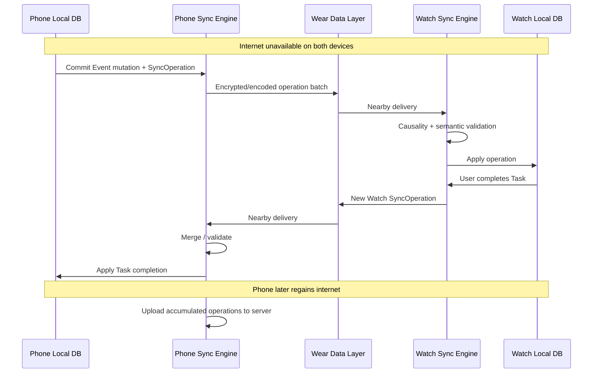

Watch is an operation-producing replica, not merely a remote UI.

---

# 15. External calendar adapter boundary

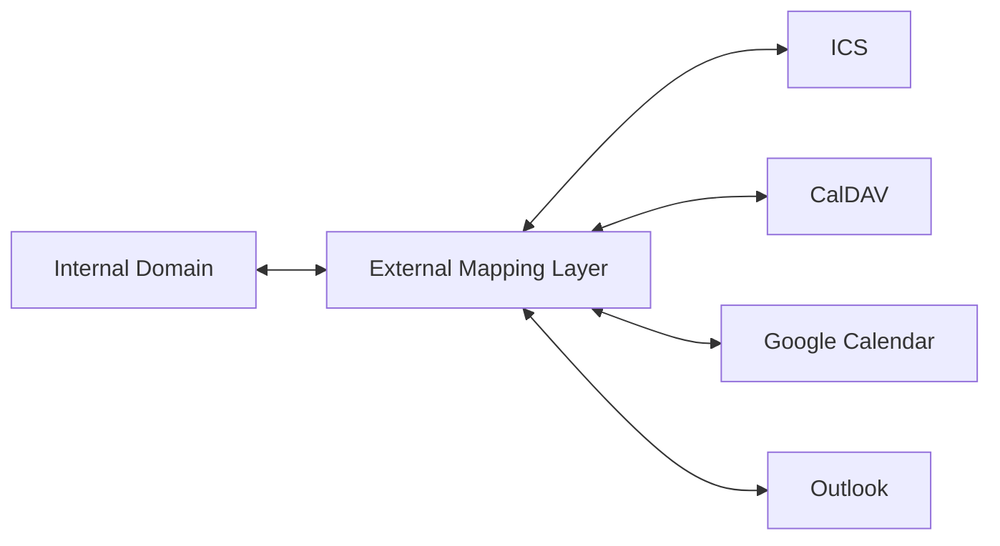

External providers are adapters. Their object models do not define the internal Event/Course/Task semantics.

Lossy mapping must be explicit where an external system cannot represent an internal concept.

---

# 16. Domain object relationships

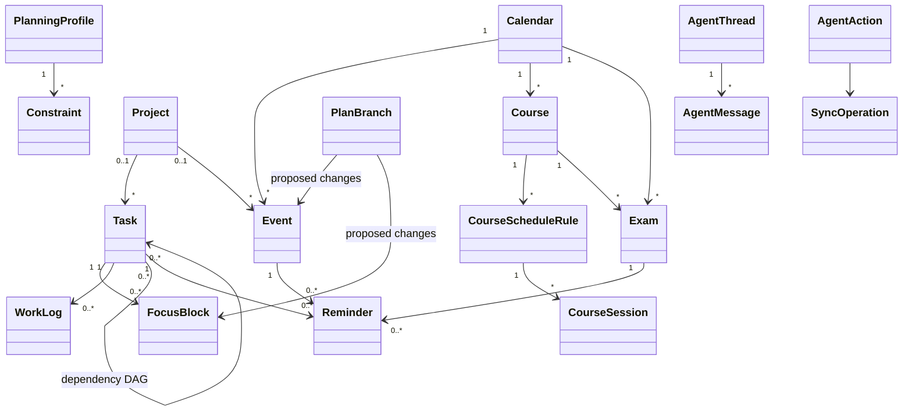

This diagram expresses semantic relationships, not a final relational database schema.

---

# 17. Explicit forbidden shortcuts

These flows are intentionally unsupported:

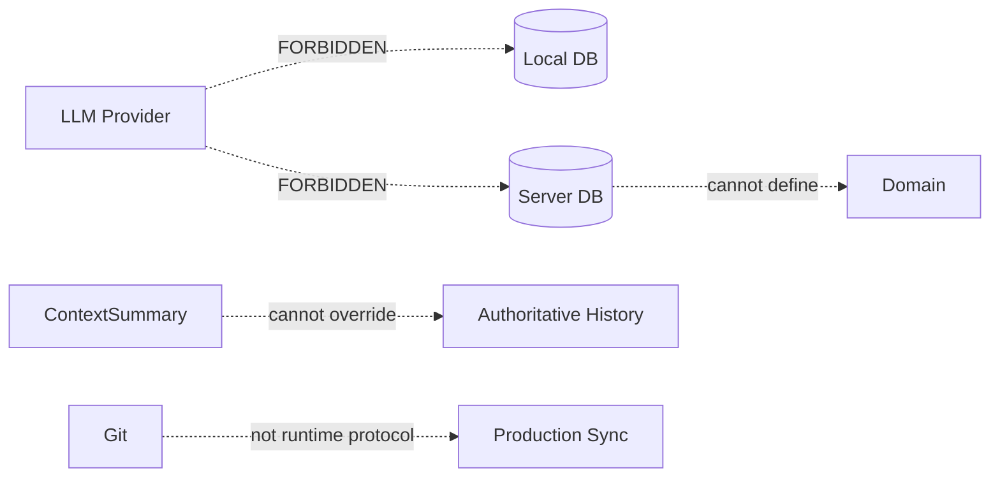

Additional forbidden assumptions:

```text
latest updatedAt wins                         NO
LLM explanation is authoritative              NO
Provider conversation ID is Agent memory       NO
Course is just RRULE Event                     NO
FocusBlock completion automatically completes Task  NO
No network means no local scheduling           NO
Wear is only a phone remote                     NO
```

---

# 18. End-to-end example: "Move Friday meeting and find two hours for PPT"

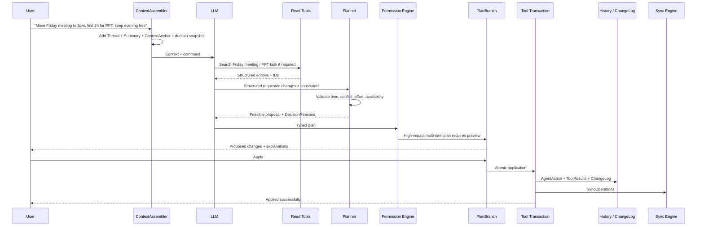

At no point does the LLM write a database record directly.

---

# 19. End-to-end example: context window has compacted old conversation

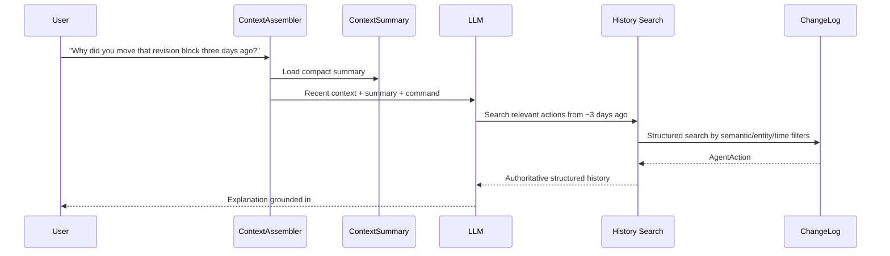

The old raw message does not need to remain inside the current model context window for the system to remember what happened.

---

# 20. Architecture review checklist

A proposed architectural change should be rejected or require an ADR if it violates any of the following without explicitly changing the baseline:

1. Does it make Domain depend on UI, database, network, or AI SDK code?
2. Does it allow LLM output to bypass typed Tools/validation/permissions?
3. Does it treat Provider session storage as Scheduler memory?
4. Does it discard authoritative history when compacting context?
5. Does it turn ChangeLog into mutable conversational text?
6. Does it collapse Task into Event or FocusBlock into Task?
7. Does it model Course as only a generic recurrence rule?
8. Does it use timestamps alone as domain time semantics?
9. Does it make Sync use Last-Write-Wins for semantic conflicts?
10. Does it let PlanBranch overwrite newer active state without revalidation?
11. Does it require the Server to read user schedule plaintext?
12. Does it make core calendar/planning functions unavailable when offline?
13. Does it reduce Wear OS to a display-only remote?
14. Does it create incompatible domain meanings across platforms?

If the answer to any item is yes, stop and write an ADR before implementation.

---

# Final architecture rule

The complete product can be summarized as:

```text
Agentic Surface
      ↓
Application-owned Context & Memory
      ↓
Typed Tool Boundary
      ↓
Deterministic Domain + Planner
      ↓
Local Transaction + Audit History
      ↓
Local-first Sync + E2EE
      ↓
Other Devices / Thin Server
```

**The LLM is replaceable. The user's time model, history, and memory are not.**
